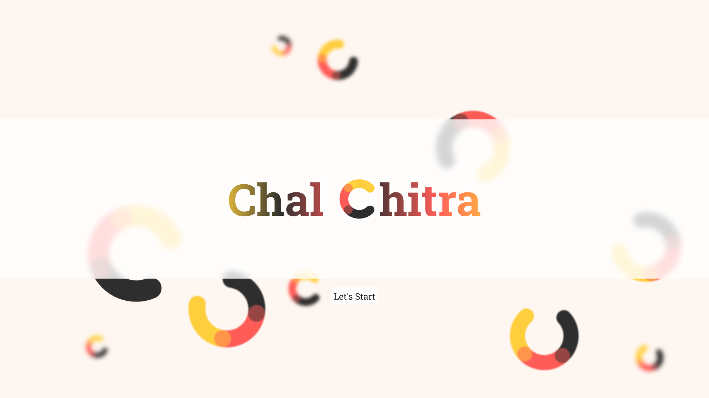
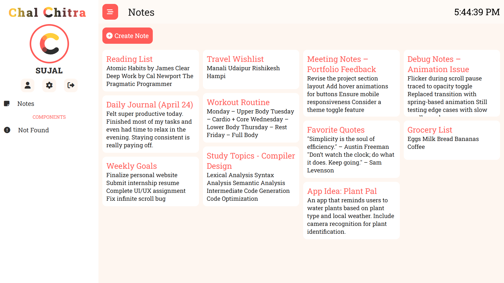

# ChalChitra

A real-time, themeable note-taking app using React.js and Firebase.  
Includes live sync, multiple themes, and protected admin routes.

## Table of Contents

- [Features](#features)
- [Tech Stack](#tech-stack)
- [Screenshots](#screenshots)
- [Installation](#installation)
- [Running the App](#running-the-app)
- [Contributing](#contributing)
- [License](#license)

## Features

- 💾 Real-time note sync
- 🎨 Multiple theme support
- 🔒 Route protection (no `/admin` without permission)
- ✨ Intuitive, responsive interface

## Tech Stack

- **Frontend:** React.js
- **Backend:** Firebase Firestore & Auth
- **Styling:** CSS Modules

## Screenshots

  


## Installation

```bash
# Get the code and dependencies
git clone https://github.com/thesujalpatel/ChalChitra.git
cd ChalChitra
npm install
```

## Running the App

```bash
# Start the development server
npm start
```

## Contributing

Contributions are welcome!

1. Fork the repository
2. Create a new branch(`git checkout -b feature/YourFeature`)
3. Make your changes
4. Commit your changes(`git commit -m 'Add some feature'`)
5. Push to the branch(`git push origin feature/YourFeature`)
6. Open a pull request

## License

This project is licensed under the MIT License. See the [LICENSE](LICENSE) file for details.
